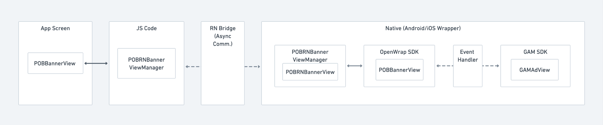

- [OpenWrap SDK Sample App for GAM header bidding](#openwrap-sdk-sample-app-for-gam-header-bidding)
  - [Description](#description)
  - [Flow diagram](#flow-diagram)
  - [Compatibility matrix](#compatibility-matrix)
  - [How to run](#how-to-run)
      - [Clone the repo \& follow the below steps:](#clone-the-repo--follow-the-below-steps)
  - [Prerequisites](#prerequisites)
  - [Getting started Android](#getting-started-android)
    - [Integrate OpenWrap SDK](#integrate-openwrap-sdk)
    - [Integrate the Google Mobile Ads SDK (GAM)](#integrate-the-google-mobile-ads-sdk-gam)
  - [Getting started iOS](#getting-started-ios)
    - [Integrate OpenWrap SDK](#integrate-openwrap-sdk-1)
    - [Integrate the Google Mobile Ads SDK (GAM)](#integrate-the-google-mobile-ads-sdk-gam-1)
  - [Mandatory global configuration](#mandatory-global-configuration)
  - [Show banner ads](#show-banner-ads)
      - [Step 1: Android/iOS specific implementation](#step-1-androidios-specific-implementation)
      - [Step 2: JS implementation](#step-2-js-implementation)
  - [Show interstitial ads](#show-interstitial-ads)
      - [Step1: Android/iOS specific implementation](#step1-androidios-specific-implementation)
      - [Step 2: JS implementation](#step-2-js-implementation-1)
  - [Show rewarded ads](#show-rewarded-ads)
      - [Step 1: Android/iOS specific implementation](#step-1-androidios-specific-implementation-1)
      - [Step 2: JS implementation](#step-2-js-implementation-2)
  - [Test and debug your integration](#test-and-debug-your-integration)
    - [Test profile/placements](#test-profileplacements)
    - [Enable SDK logs](#enable-sdk-logs)
    - [Advanced topics](#advanced-topics)
  - [Support](#support)
  - [License](#license)

# OpenWrap SDK Sample App for GAM header bidding

## Description
GAM Sample App demonstrates the delivery of ads using OpenWrap SDK via GAM header bidding.

## Flow diagram


## Compatibility matrix

| Platform | OpenWrap SDK | OpenWrap SDK Event Handler |     GAM SDK     |
| :------- | :----------: | :------------------------: | :-------------: |
| Android  |    3.3.0     |           3.0.0            | 20.4.0 - 22.4.0 |
| iOS      |    3.3.0     |           4.0.0            | 8.12.0 - 10.5.0 |

> Note: Application is tested on Xcode 14.*
## How to run

#### Clone the repo & follow the below steps:
- Install the dependencies
```bash
cd GAMSampleApp/
npm install
```

-  Follow below instructions for iOS
    -  Install `pods`
      ```bash
      cd ios/
      pod install
      cd ../
      ```

    -  Run the app
      ```bash
      npx react-native run-ios
      ```

-  Follow below instructions for Android
    ```bash
    npx react-native run-android
    ```


## Prerequisites

-  Before starting OpenWrap SDK integration with supported ads in your app, you must have the following details. **Please contact your account manager for the details**.
    -  Publisher Id
    -  OpenWrap Profile Id 
    -  OpenWrap Ad Unit Id
    -  GAM Ad Unit Id
    -  GAM Application Id

## Getting started Android

### Integrate OpenWrap SDK
Refer to [Integrate OpenWrap SDK](https://community.pubmatic.com/display/ADFP#GetstartedwithAndroidOpenWrapSDKforGAM-IntegrateOpenWrapSDK) for integrating OpenWrap SDK.

### Integrate the Google Mobile Ads SDK (GAM)
Refer to [Integrate the Google Mobile Ads SDK (GAM)](https://community.pubmatic.com/display/ADFP#GetstartedwithAndroidOpenWrapSDKforGAM-IntegratetheGoogleMobileAdsSDK(GAM)) for integrating GAM SDK.

## Getting started iOS

### Integrate OpenWrap SDK
Refer to [Integrate OpenWrap SDK](https://community.pubmatic.com/display/IDFP#GetstartedwithiOSOpenWrapSDKforGAM-IntegrateOpenWrapSDK) for integrating OpenWrap SDK.

### Integrate the Google Mobile Ads SDK (GAM)
Refer to [Integrate the Google Mobile Ads SDK (GAM)](https://community.pubmatic.com/display/IDFP#GetstartedwithiOSOpenWrapSDKforGAM-IntegrateGoogleMobileAdsSDK(GAM)) for integrating GAM SDK.

## Mandatory global configuration
Refer to `Mandatory global configuration`([Android](https://community.pubmatic.com/display/AOPO/Show+banner+ads#Showbannerads-Mandatoryglobalconfiguration)/[iOS](https://community.pubmatic.com/display/IOPO/Show+banner+ads#Showbannerads-Mandatoryglobalconfiguration)) section for setting your application's store URL in your `MainApplication/AppDelegate` files.

## Show banner ads
#### Step 1: Android/iOS specific implementation
  1. Add the `POBRNBannerView`([Android](android/app/src/main/java/com/pubmatic/sampleapp/banner/POBRNBannerView.kt)/[iOS](ios/GAMSampleApp/HeaderBidding/Banner/POBRNBannerView.m)) class to your project's platform-specific source directories.
     - Used to request banner ads from OW SDK using GAM header bidding.

  2. Add the `POBRNBannerViewManager`([Android](android/app/src/main/java/com/pubmatic/sampleapp/banner/POBRNBannerViewManager.kt)/[iOS](ios/GAMSampleApp/HeaderBidding/Banner/POBRNBannerViewManager.m)) class to your project's platform-specific source directory.
     - Used by the JS wrapper class to request ads and receive callbacks from platform-specific implementation. This module will interact with `POBRNBannerView` to get ads and callbacks and will send those details back to the JS code.

  3. Add the `POBAdUnitDetails`([Android](android/app/src/main/java/com/pubmatic/sampleapp/banner/POBAdUnitDetails.kt)/[iOS](ios/GAMSampleApp/HeaderBidding/Banner/POBAdUnitDetails.m)) class to your project's platform-specific source directory.
     -  Used to store the ad unit details like Publisher ID, Profile ID, Ad Unit ID, etc. which are received from the JS side.

  4. (Specific to Android) Register the `POBRNBannerViewManager` module in the app's package file as described in the [`OpenWrapSDKPackage`](android/app/src/main/java/com/pubmatic/sampleapp/OpenWrapSDKPackage.kt) class.
#### Step 2: JS implementation
  5. Add the [`POBBannerView.tsx`](src/ads/POBBannerView.tsx) file to your project.
     - Used by applications to request ads from OW SDK using GAM header bidding.
     -  It is a component that takes required props `adUnitDetails` and optional callbacks.
  6. Load banner ad
     -  Obtain your *Publisher ID*, *Profile ID*, *OpenWrap Ad Unit ID*, and *DFP Ad Unit ID* as mentioned in the required dependencies. You can also use PubMatic's test profile/placements during integration.
     -  Add the POBBannerView component to your view hierarchy.
     -  Pass the optional listeners as props of the POBBannerView component.
     -  Once the component is mounted in the hierarchy POBBannerView internally calls `loadAd()` and adds the view to the hierarchy after loading.
  -  Refer to the [`BannerScreen.tsx`](src/screens/BannerScreen.tsx) screen to understand the use of the [`POBBannerView.tsx`](src/ads/POBBannerView.tsx) component to request banner ads.

## Show interstitial ads
#### Step1: Android/iOS specific implementation
  1. Add the `POBRNInterstitialAd`([Android](android/app/src/main/java/com/pubmatic/sampleapp/interstitial/POBRNInterstitialAd.kt)/[iOS](ios/GAMSampleApp/HeaderBidding/Interstitial/POBRNInterstitial.m)) class to your project's platform-specific source directories as described in the sample app.    
     -  Used to request interstitial ads from OW SDK using GAM header bidding.

  2. Add the `POBRNInterstitialModule`([Android](android/app/src/main/java/com/pubmatic/sampleapp/interstitial/POBRNInterstitialModule.kt)/[iOS](ios/GAMSampleApp/HeaderBidding/Interstitial/POBRNInterstitialModule.m)) class to your project's platform-specific source directory as described in the sample app.
     -  Used by the JS wrapper class to request ads and receive callbacks from platform-specific implementation.
     -  It interacts with `POBRNInterstitial` to get ads and callbacks and will send those details back to the JS code.
  3. Register the `POBRNInterstitialModule` module in the app's package file as described in the [`OpenWrapSDKPackage`](android/app/src/main/java/com/pubmatic/sampleapp/OpenWrapSDKPackage.kt) class(Specific to Android).

#### Step 2: JS implementation
  4. Add the `POBInterstitial.ts` file to your project.
     -  Used by applications to request ads from OW SDK using GAM header bidding.
     -  It contains public APIs to load and show interstitial ads.
  5. Load interstitial ad
     -  Obtain your Publisher ID, Profile ID, OpenWrap Ad Unit ID, and DFP Ad Unit ID as mentioned in the required dependencies. You can also use PubMatic's test profile/placements during integration.
     -  Create a  POBInterstitial instance in your component.
     -  Set optional listeners by setting setListener on the interstitial instance to get the callbacks from POBInterstitial.
     -  Call `loadAd()` on your interstitial instance. This initiates the ad request to the server and pre-renders it when received.
     -  Call `showAd()` to display the ad to the user.
  -  Refer to the [`InterstitialScreen.tsx`](src/screens/InterstitialScreen.tsx) screen to understand the use of the [`POBInterstitial.ts`](src/ads/POBInterstitial.ts) class to request interstitial ads.

## Show rewarded ads
#### Step 1: Android/iOS specific implementation
  1. Add the `POBRNRewardedAd`([Android](android/app/src/main/java/com/pubmatic/sampleapp/rewarded/POBRNRewardedAd.kt)/[iOS](ios/GAMSampleApp/HeaderBidding/RewardedAd/POBRNRewardedAd.m)) class to your project's platform-specific source directories.
     -  Used to request interstitial ads from OW SDK using GAM header bidding.
  2. Add the `POBRNRewardedAdModule`([Android](android/app/src/main/java/com/pubmatic/sampleapp/rewarded/POBRNRewardedAdModule.kt)/[iOS](ios/GAMSampleApp/HeaderBidding/RewardedAd/POBRNRewardedAdModule.m)) class to your project's platform-specific source directory.
     -  Used by the JS wrapper class to request ads and receive callbacks from platform-specific implementation. 
     -  It interacts with `POBRNRewardedAd` to get ads and callbacks and will send those details back to the JS code.
  3. (Specific to Android) Register the `POBRNRewardedAdModule` module in the app's package file as described in the [`OpenWrapSDKPackage`](android/app/src/main/java/com/pubmatic/sampleapp/OpenWrapSDKPackage.kt) class.
#### Step 2: JS implementation
  4. Add [`POBRewardedAd.ts`](src/ads/POBRewardedAd.ts) to your project.
     -  Used by applications to request ads from OW SDK using GAM header bidding.
     -  It contains public APIs to load and show interstitial ads.
  5. Load rewarded ad
     -  Obtain your Publisher ID, Profile ID, OpenWrap Ad Unit ID, and DFP Ad Unit ID as mentioned in the required dependencies. You can also use PubMatic's test profile/placements during integration.
     -  Create a  POBRewardedAd instance in your component.
     -  Set optional listeners by setting setListener on the rewarded instance to get the callbacks from POBRewardedAd.
     -  Call `loadAd()` on your rewarded instance. This initiates the ad request to the server and pre-renders it when received.
     -  Call `showAd()` to display the ad to the user.
  -  Refer to the [`RewardedScreen.tsx`](src/screens/RewardedScreen.tsx) component to understand the use of the [`POBRewardedAd.ts`](src/ads/POBRewardedAd.ts) class to request rewarded ads.

## Test and debug your integration
Before releasing your ad-enabled app into the world, you must first test that your SDK integration is working correctly, and debug as necessary.
### Test profile/placements
| AD TYPE                | PUBLISHER ID | PROFILE ID | TEST AD SIZES                                                                                                                      | DFP AD UNIT ID'S                             | OPENWRAP AD UNIT ID'S                        |
| ---------------------- | ------------ | ---------- | ---------------------------------------------------------------------------------------------------------------------------------- | -------------------------------------------- | -------------------------------------------- |
| **Banner**             | 156276       | 1165       | [AdSize.MEDIUM_RECTANGLE](src/models/AdSize.ts), [AdSize.BANNER](src/models/AdSize.ts), [AdSize.FULL_BANNER](src/models/AdSize.ts) | /15671365/pm_sdk/PMSDK-Demo-App-Banner       | /15671365/pm_sdk/PMSDK-Demo-App-Banner       |
| **MREC Video**         | 156276       | 1757       | [AdSize.MEDIUM_RECTANGLE](src/models/AdSize.ts)                                                                                    | /15671365/pm_sdk/PMSDK-Demo-App-Banner       | /15671365/pm_sdk/PMSDK-Demo-App-Banner       |
| **Interstitial**       | 156276       | 1165       | N/A                                                                                                                                | /15671365/pm_sdk/PMSDK-Demo-App-Interstitial | /15671365/pm_sdk/PMSDK-Demo-App-Interstitial |
| **Interstitial Video** | 156276       | 1757       | N/A                                                                                                                                | /15671365/pm_sdk/PMSDK-Demo-App-Interstitial | /15671365/pm_sdk/PMSDK-Demo-App-Interstitial |
| **Rewarded**           | 156276       | 1757       | N/A                                                                                                                                | /15671365/pm_sdk/PMSDK-Demo-App-RewardedAd   | /15671365/pm_sdk/PMSDK-Demo-App-RewardedAd   |
```diff
- Warning - PubMatic assumes no financial responsibility for going live with test placements…
- Before you submit your app to the App Store, you must replace all Test Placement IDs with an actual Profile ID and Pub ID associated with your account.
```

### Enable SDK logs
Use OpenWrap SDK logs to troubleshoot issues and confirm everything is working as expected during debugging. Refer `Enable SDK logs`([Android](https://community.pubmatic.com/display/AOPO/Test+and+debug+your+integration#Testanddebugyourintegration-EnableSDKlogs)/[iOS](https://community.pubmatic.com/display/IOPO/Test+and+debug+your+integration#Testanddebugyourintegration-EnableSDKlogs)) section for enabling SDK logs. Add the given code to your app's `MainApplication.kt/AppDelegate.m` file.

### Advanced topics

OpenWrap SDK provides various fields and methods to pass information to PubMatic like demographics, compliance policies for COPPA or GDPR, etc. The following links cover a wide range of topics relevant to mediation adapter integration:

- Test and debug your integration ([Android](https://community.pubmatic.com/display/AOPO/Test+and+debug+your+integration#title-text)/[iOS](https://community.pubmatic.com/display/IOPO/Test+and+debug+your+integration#title-text))
- Pass GDPR and GDPR consent([Android](https://community.pubmatic.com/display/AOPO/Advanced+topics#Advancedtopics-PassGDPRandGDPRconsent)/[iOS](https://community.pubmatic.com/display/IOPO/Advanced+topics#Advancedtopics-PassGDPRandGDPRconsent))
- Pass GPP consent([Android](https://community.pubmatic.com/display/AOPO/Advanced+topics#Advancedtopics-PassGPPconsent)/[iOS](https://community.pubmatic.com/display/IOPO/Advanced+topics#Advancedtopics-PassGPPconsent))
- Pass COPPA compliance([Android](https://community.pubmatic.com/display/AOPO/Advanced+topics#Advancedtopics-PassCOPPAcompliance)/[iOS](https://community.pubmatic.com/display/IOPO/Advanced+topics#Advancedtopics-PassCOPPAcompliance))
- Configure SSL (for PubMatic ad requests)([Android](https://community.pubmatic.com/display/AOPO/Advanced+topics#Advancedtopics-ConfigureSSL)/[iOS](https://community.pubmatic.com/display/IOPO/Advanced+topics#Advancedtopics-ConfigureSSL))
- Control location detection([Android](https://community.pubmatic.com/display/AOPO/Advanced+topics#Advancedtopics-Controllocationdetection)/[iOS](https://community.pubmatic.com/display/IOPO/Advanced+topics#Advancedtopics-Controllocationdetection))
- Manage advertising identifier([Android](https://community.pubmatic.com/display/AOPO/Advanced+topics#Advancedtopics-Manageadvertisingidentifier)/[iOS](https://community.pubmatic.com/display/IOPO/Advanced+topics#Advancedtopics-Manageadvertisingidentifier(preiOS14only)))
- Pass app information([Android](https://community.pubmatic.com/display/AOPO/Advanced+topics#Advancedtopics-Passappinformation)/[iOS](https://community.pubmatic.com/display/IOPO/Advanced+topics#Advancedtopics-Passappinformation))
- Pass user information([Android](https://community.pubmatic.com/display/AOPO/Advanced+topics#Advancedtopics-Passuserinformation)/[iOS](https://community.pubmatic.com/display/IOPO/Advanced+topics#Advancedtopics-Passuserinformation))
- Use internal browser([Android](https://community.pubmatic.com/display/AOPO/Advanced+topics#Advancedtopics-Useinternalbrowser)/[iOS](https://community.pubmatic.com/display/IOPO/Advanced+topics#Advancedtopics-Useinternalbrowser))
- User identity([Android](https://community.pubmatic.com/display/AOPO/Advanced+topics#Advancedtopics-Useridentity(datapartnerIDs))/[iOS](https://community.pubmatic.com/display/IOPO/Advanced+topics#Advancedtopics-UserIdentity(DataPartnerIDs)))
- First-party data([Android](https://community.pubmatic.com/display/AOPO/Advanced+topics#Advancedtopics-First-partydata(segmentIDs))/[iOS](https://community.pubmatic.com/display/IOPO/Advanced+topics#Advancedtopics-First-partydata(segmentIDs)))

## Support
You will need a PubMatic account to enable the ads. Please contact your [account manager](https://pubmatic.com/contact-us/).

## License
- See [LICENSE](LICENSE) file.
